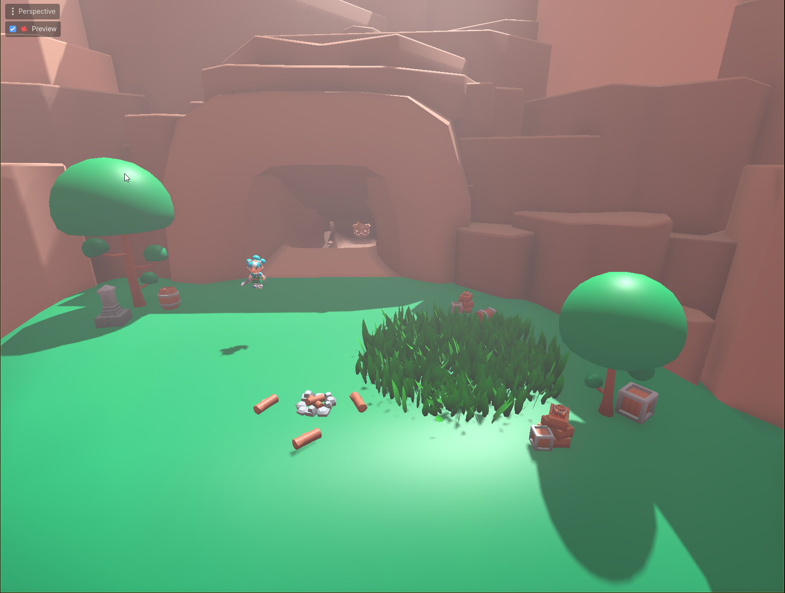
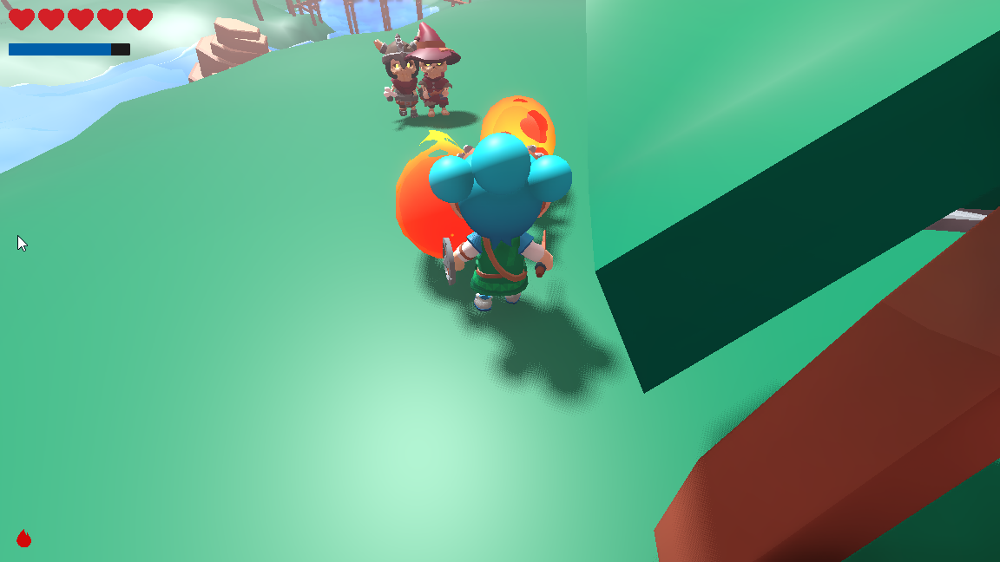

# 🗡️ BotW-Inspired 3D Game — Godot 4 Learning Project

> A Breath of the Wild-inspired 3D prototype built in Godot 4 while following the
> [Clear Code — Recreating Zelda: BotW in Godot](https://youtu.be/AoGOIiBo4Eg) course.
> This is a **study project**, not a commercial product or fan game distribution.


---

## 📸 Screenshots

<!-- Замени на свои скриншоты -->
| Gameplay | Combat | Environment |
|----------|--------|-------------|
|  |  |

---

## 🎮 What's in the project

This prototype covers the core systems I built while learning 3D game development in Godot 4:

- **3D movement** — third-person character controller with smooth camera
- **Animations** — state machine with blend trees for idle, walk, run, combat
- **Combat system** — melee attacks, hitboxes, enemy reactions
- **Basic AI** — enemy detection, patrolling, chase and attack behaviour
- **Level design** — terrain, props, environmental storytelling
- **Lighting** — dynamic lighting setup, time-of-day feel
- **Shaders** — custom visual effects (water, outline, wind on grass)
- **VFX** — particle systems for hits, ambient effects

---

## 🧠 What I learned

| Topic | Details |
|-------|---------|
| 3D basics | Nodes, transforms, 3D space, camera rigs |
| GDScript | Signals, exported variables, state machines |
| Animation | AnimationPlayer, AnimationTree, blend spaces |
| Physics | CharacterBody3D, RayCast3D, Area3D for detection |
| Shaders | Visual Shader editor, custom ShaderMaterial |
| VFX | GPUParticles3D, particle materials, mesh effects |
| Level Design | CSGMesh, GridMap, lighting workflow |

---

## 📁 Project structure

```          
├── addons/
├── audio/
├── demo/
├── graphics/
├── scenes/
│   ├── player/      
│   ├── enemies/     
│   ├── world/       
│   └── ui/          
├── scripts/         
└── shaders/         
```

---

## ⚠️ Disclaimer

This project is a **personal learning exercise** inspired by The Legend of Zelda: Breath of the Wild.
All rights to Zelda and related IP belong to Nintendo.
This prototype uses no Nintendo assets — all models, sounds and textures are either
from the course resources, open-licensed sources, or created by me.
The project is **not for commercial distribution**.

---

## 🙏 Credits

- Course by [Clear Code](https://www.youtube.com/@ClearCode) — excellent 3D Godot introduction
- Built with [Godot Engine 4](https://godotengine.org/) (MIT License)
